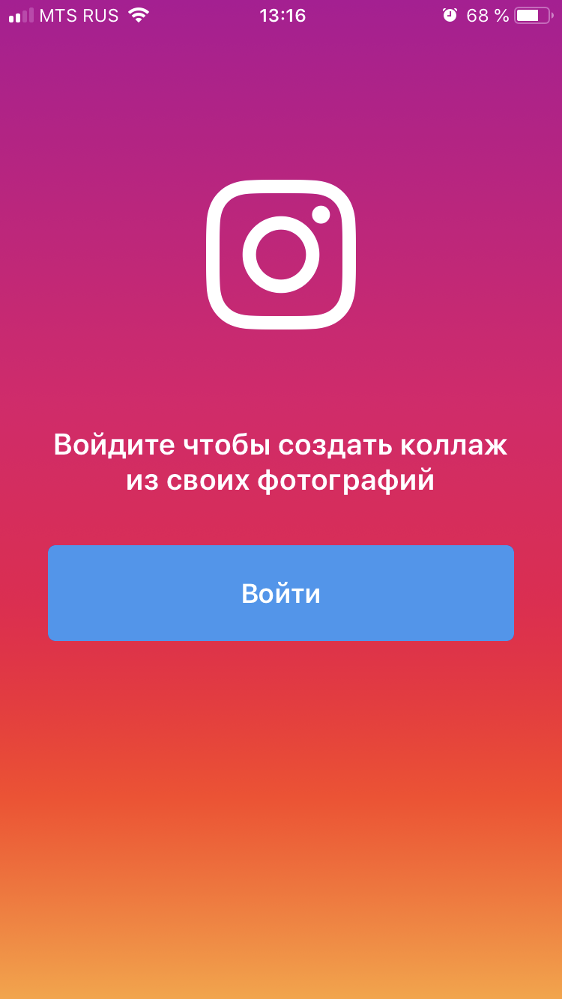
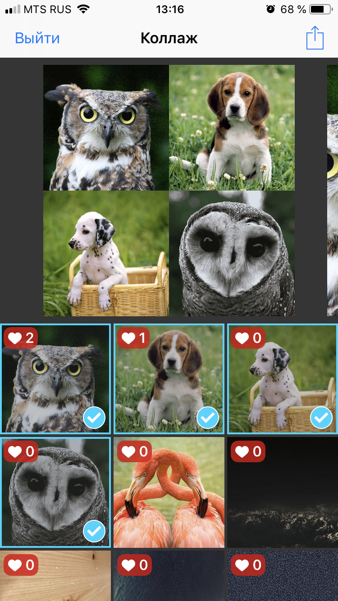

# Collage iOS

Collage — iOS приложение для создания коллажа из Instagram фотографий.

  
  

## Функции
* Интеграция с Instagram API
* Сортировка фотографий по количеству лайков
* Экспорт созданного коллажа
* Выбор типа коллажа
* Сохранение данных в CoreData для оффлайн работы
* Локализация

## Технологии
Nuke, CoreData, AutoLayout, Localization 
Swift 4.2, iOS 11/12, Xcode 10.1

## Настройка
Для сборки проекта необходимо указать `clientID` в файле `Helpers/InstagramURLBuilder.swift`.

## Скриншоты
 
